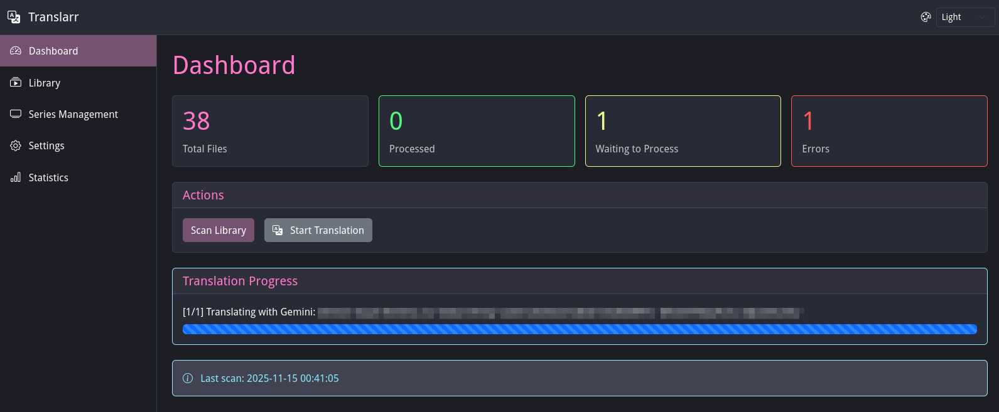
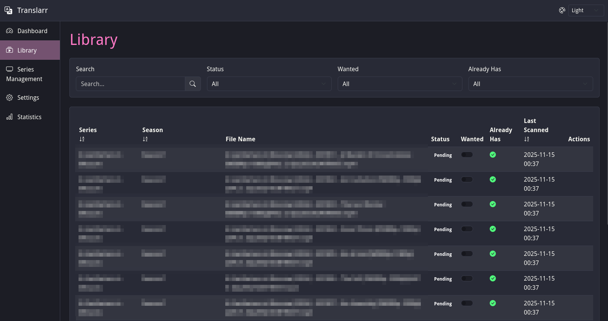
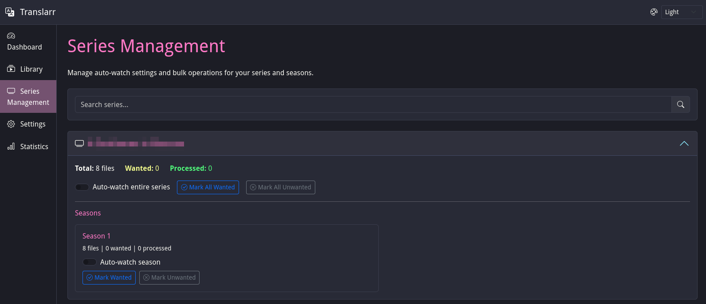
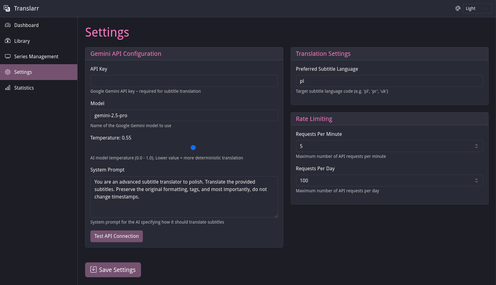

<h1>
  
  Translarr
</h1>

[](https://dotnet.microsoft.com/download/dotnet/10.0)
[](https://www.gnu.org/licenses/gpl-3.0)
[](https://github.com/jmcjm/Translarr/actions)
[](https://github.com/jmcjm/Translarr/commits/main)
[](https://github.com/jmcjm/Translarr/issues)


**Translarr is a self-hosted application designed to automate the process of translating subtitles for your media library.** Inspired by the *arr suite of tools, Translarr scans your video files, identifies those missing subtitles in your preferred language, and uses AI (supporting multiple LLM providers) to generate and save new, translated subtitle files.

## Key Features

*   **Automated Library Scanning:** Recursively scans your media directories to discover all video files.
*   **Smart Subtitle Detection:** Automatically checks for existing preferred-language subtitles to avoid redundant work. Filters out bitmap-based subtitles (PGS, VobSub) that can't be translated without OCR.
*   **Intelligent Stream Selection:** Analyzes embedded subtitle tracks to select the best source for translation (e.g., prioritizing non-SDH English tracks).
*   **AI-Powered Translation:** Supports multiple LLM providers (Google Gemini, OpenAI, Anthropic, and more) for high-quality, context-aware subtitle translation. Configurable per-provider with their respective API keys and models.
*   **Modern Web UI:** A clean, responsive dashboard built with Blazor Server.
*   **Authentication:** Single admin account with JWT-based auth. Setup wizard on first launch, login with "Remember me" support. Rate-limited login with account lockout.
*   **Translation Control:** Start and stop translations at any time from the dashboard.
*   **Dashboard & Statistics:** Get a quick overview of your library's state: total files, processed, waiting, and errors.
*   **Powerful Library Management:** Search, filter, and sort your media files. Manually toggle the "wanted" status for individual files.
*   **Customizable Settings:** Easily configure your LLM provider and API key, select the AI model, customize the system prompt, set rate limits, change password, and more.

## Technology Stack

*   **Backend:** .NET 10, ASP.NET Core, Entity Framework Core
*   **Frontend:** Blazor Server with Havit Blazor
*   **Database:** SQLite (via `CommunityToolkit.Aspire.Hosting.SQLite` and EFCore)
*   **AI Engine:** Multiple LLM providers (Google Gemini, OpenAI, Anthropic, and others via OpenAI-compatible API)
*   **Media Processing:** FFmpeg (via `FFMpegCore`)
*   **Authentication:** ASP.NET Identity + JWT Bearer
*   **Orchestration:** .NET Aspire

## Architecture

The project is built using .NET Aspire, following a distributed application model:

*   **`AppHost`**: The Aspire project that orchestrates the different services.
*   **`Translarr.Core.Api`**: The backend REST API service. Thin endpoint handlers, JWT Bearer auth.
*   **`Translarr.Core.Application`**: Business logic interfaces, DTOs, and service contracts.
*   **`Translarr.Core.Infrastructure`**: Data access, external integrations (FFmpeg, LLM clients, Identity), service implementations.
*   **`Translarr.Frontend.HavitWebApp`**: The Blazor Server frontend for the user interface.
*   **`ServiceDefaults`**: Shared configurations for health checks, resilience, and OpenTelemetry.

The backend follows Clean Architecture principles with `Application`, `Infrastructure`, and `Api` layers.

## Getting Started

### Docker Compose

**Prerequisites:**
- Docker & Docker Compose
- API key for your chosen LLM provider (e.g., Gemini from [Google AI Studio](https://aistudio.google.com/app/apikey))

**Quick Start:**

1.  **Download compose.yaml:**

    ```sh
    curl -o compose.yaml https://raw.githubusercontent.com/jmcjm/Translarr/refs/heads/main/compose.yaml
    ```

2.  **Configure environment variables:**

    Set the following environment variables (via `.env` file, Portainer, or your deployment tool):

    | Variable | Required | Description |
    |---|---|---|
    | `MEDIA_ROOT_PATH` | Yes | Path to your media library on the host |
    | `API_PORT` | Yes | Port for the API service |
    | `WEB_PORT` | Yes | Port for the Web UI |
    | `JWT_SECRET` | Yes | Secret key for JWT tokens (min 32 characters) |

3.  **Launch the application:**
    ```sh
    docker compose up -d
    ```

4.  **First-run setup:**
    - Open the Web UI at `http://your-host:WEB_PORT`
    - You'll be redirected to the setup wizard
    - Create your admin account (username + password, min 8 characters)
    - You're in!

### Initial Configuration

1.  Open Translarr and log in.
2.  Navigate to **Settings** from the sidebar.
3.  Select your **LLM Provider** from the dropdown and enter the corresponding **API Key**. Supported providers:
    - Google Gemini
    - OpenAI
    - Anthropic Claude
    - xAI Grok
    - DeepSeek
    - Any OpenAI-compatible API (select "Custom" and enter the base URL)
4.  Choose a **Model** from the suggested list or enter a custom model name.
5.  Set your **Preferred Subtitle Language** using its two-letter language code (e.g., `pl` for Polish, `es` for Spanish).
6.  Review and adjust other settings like Temperature or Max Output Tokens if desired, then click **Save**.

## Usage Workflow

1.  **Scan:** Go to the **Dashboard** and click **Scan Library**. This will populate the application with your media files.
2.  **Select:** Navigate to the **Library** page. Files that don't have subtitles in your preferred language can be marked for translation. Toggle the **Wanted** switch for any files you wish to translate.
3.  **Translate:** Return to the **Dashboard** and click **Start Translation**. Translarr will begin processing the "wanted" files in the queue. You can stop the translation at any time with the **Stop Translation** button.
4.  **Monitor:** You can see the real-time translation progress on the Dashboard. Once completed, the new `.srt` subtitle file (e.g., `My.Episode.S01E01.pl.srt`) will be saved in the same directory as its video file.

## Screenshots

[](./.github/assets/DashboardHavit.png)

-------

[](./.github/assets/LibraryHavit.png)

-------

[](./.github/assets/SeriesManagmentHavit.png)

-------

[](./.github/assets/SettingsHavit.png)

## TODO & Future Plans

*   **Worker Service for Automation:**
    *   A background worker service is planned to enable fully automated, scheduled tasks. This will handle periodic library scans and automatically queue new files for translation.

*   **SELinux Compatibility:**
    *   Containers do not work on systems with SELinux set to `enforcing`.

*   **OCR Support:**
    *   Bitmap-based subtitles (PGS, VobSub) are currently skipped. OCR integration would allow extracting text from these for translation.

## License

This project is licensed under the **GNU General Public License v3.0**. See the [LICENSE](LICENSE) file for more details.
