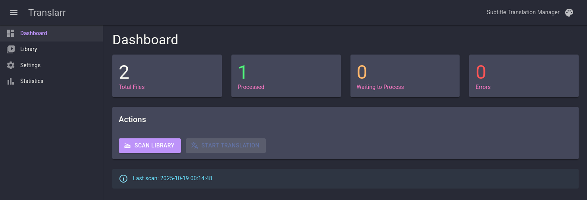
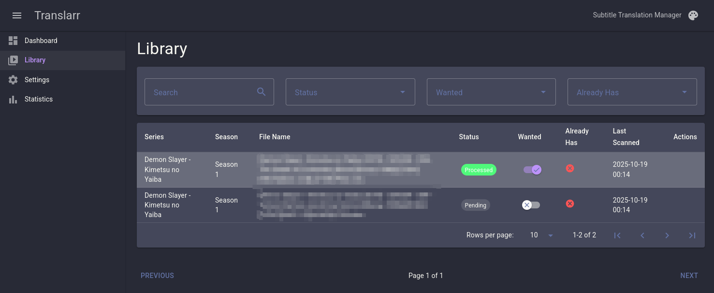
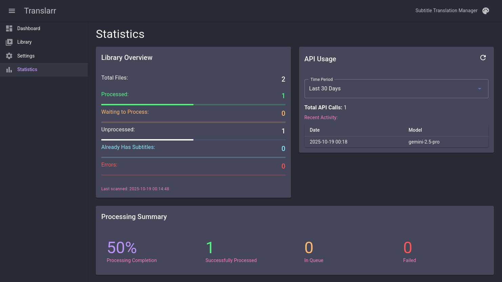
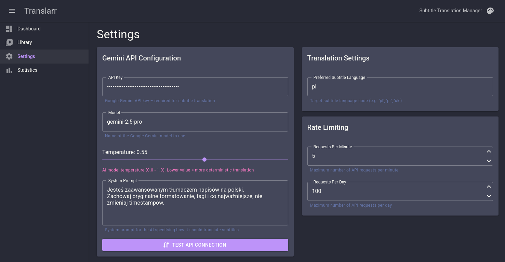

# Translarr

[](https://dotnet.microsoft.com/download/dotnet/9.0)
[](https://www.gnu.org/licenses/gpl-3.0)

**Translarr is a self-hosted application designed to automate the process of translating subtitles for your media library.** Inspired by the \*arr suite of tools, Translarr scans your video files, identifies those missing subtitles in your preferred language, and uses the power of Google's Gemini AI to generate and save new, translated subtitle files.

## ✨ Key Features

*   **📚 Automated Library Scanning:** Recursively scans your media directories to discover all video files.
*   **🌐 Smart Subtitle Detection:** Automatically checks for existing preferred-language subtitles to avoid redundant work.
*   **🎯 Intelligent Stream Selection:** Analyzes embedded subtitle tracks to select the best source for translation (e.g., prioritizing non-SDH English tracks).
*   **🤖 AI-Powered Translation:** Leverages the Google Gemini API for high-quality, context-aware subtitle translation. Gemini was specifically chosen for its advantages:  
    * **Large Context Window:** Its ability to handle a large number of tokens allows entire subtitle files to be processed in a single request, ensuring better context retention and translation consistency.
    *   **Great Free Tier:** The API provides a substantial free tier (100 calls per day to the 2.5 Pro model), making the service highly accessible and cost-effective for personal use.
*   **✨ Modern Web UI:** A clean, responsive dashboard built with Blazor and MudBlazor to manage your library, monitor progress, and configure settings.
*   **📊 Dashboard & Statistics:** Get a quick overview of your library's state: total files, processed, waiting, and errors.
*   **🔍 Powerful Library Management:** Search, filter, and sort your media files. Manually toggle the "wanted" status for individual files.
*   **⚙️ Customizable Settings:** Easily configure your Gemini API key, select the AI model, customize the system prompt, set rate limits, and more.

## 🛠️ Technology Stack

*   **Backend:** .NET 9, ASP.NET Core, Entity Framework Core
*   **Frontend:** Blazor Server
*   **UI Framework:** MudBlazor
*   **Database:** SQLite (via ```CommunityToolkit.Aspire.Hosting.SQLite``` and EFCore)
*   **AI Engine:** Google Gemini API (via ```Mscc.GenerativeAI``` nuget)
*   **Media Processing:** FFmpeg (via ```FFMpegCore``` nuget)
*   **Orchestration:** .NET Aspire

## 🏗️ Architecture

The project is built using .NET Aspire, following a distributed application model:

*   **`AppHost`**: The Aspire project that orchestrates the different services.
*   **`Translarr.Core.Api`**: The backend REST API service handling all core logic (scanning, translation, database operations).
*   **`Translarr.Frontend.WebApp`**: The Blazor Server frontend for the user interface.
*   **`ServiceDefaults`**: A shared project for common configurations like health checks, resilience, and OpenTelemetry.

The backend itself follows Clean Architecture principles, separating concerns into `Application`, `Infrastructure`, and `Api` layers.

## 🚀 Getting Started - still WIP!

### 🐳 Option 1: Docker Compose (Recommended)

**Prerequisites:**
- Docker & Docker Compose
- Google Gemini API Key (get one for free from [Google AI Studio](https://aistudio.google.com/app/apikey))

**Quick Start:**

1.  **Copy compose.yaml and .env.example:**

    ```sh
    curl -o compose.yaml https://raw.githubusercontent.com/jmcjm/Translarr/refs/heads/main/compose.yaml
    curl -o .env https://raw.githubusercontent.com/jmcjm/Translarr/refs/heads/main/env.example
    ```

2.  **Configure environment:**

    *   Edit `.env` and set your media path:
    ```env
    MEDIA_ROOT_PATH=/path/to/your/media
    API_PORT=5000
    WEB_PORT=5001
    ```

3.  **Launch the application:**
    ```sh
    docker compose up -d
    ```

4.  **Access the application:**
    - **Web UI:** http://localhost:5001
    - **API:** http://localhost:5000
    - **API Swagger:** http://localhost:5000/swagger

For detailed Docker setup instructions, troubleshooting, and backup procedures, see **[DOCKER_SETUP.md](DOCKER_SETUP.md)**.

---

### 💻 Option 2: Development with .NET Aspire

**Prerequisites:**
1.  **[.NET 9 SDK](https://dotnet.microsoft.com/download/dotnet/9.0)**
2.  **[FFmpeg](https://ffmpeg.org/download.html)**: Must be installed and accessible from your system's `PATH`.
3.  **Google Gemini API Key**: You can get one for free from **[Google AI Studio](https://aistudio.google.com/app/apikey)**.

**Installation & Running:**

1.  **Clone the repository:**
    ```sh
    git clone https://github.com/jmcjm/Translarr.git
    cd Translarr
    ```

2.  **Configure Media Path:**
    *   Open the `Translarr/AppHost/appsettings.Development.json` file.
    *   Change the `MediaRootPath` to the absolute path of your media library.
    ```json
    {
      "Logging": { ... },
      "MediaRootPath": "/path/to/your/videos"
    }
    ```

3.  **Run the application:**
    *   Navigate to the `AppHost` project directory and run it:
    ```sh
    cd AppHost
    dotnet run
    ```
    *   .NET Aspire will launch the API, the WebApp, and a dashboard. The Aspire Dashboard URL will be shown in the console, where you can find the endpoint for the Translarr WebApp.

### Initial Configuration

1.  Open the Translarr web interface in your browser (check the Aspire Dashboard for the correct URL).
2.  Navigate to the **Settings** page from the sidebar.
3.  Enter your **Google Gemini API Key**.
4.  Set your **Preferred Subtitle Language** using its two-letter language code (e.g., `pl` for Polish, `es` for Spanish, `fr` for French).
5.  Review and adjust other settings like the AI Model or Temperature if desired, then click **Save**.

## 📖 Usage Workflow

1.  **Scan:** Go to the **Dashboard** and click **Scan Library**. This will populate the application with your media files.
2.  **Select:** Navigate to the **Library** page. Files that don't have subtitles in your preferred language can be marked for translation. Toggle the **Wanted** switch for any files you wish to translate.
3.  **Translate:** Return to the **Dashboard** and click **Start Translation**. Translarr will begin processing the "wanted" files in the queue.
4.  **Monitor:** You can see the real-time translation progress on the Dashboard. Once completed, the new `.srt` subtitle file (e.g., `My.Episode.S01E01.pl.srt`) will be saved in the same directory as its video file.

## 📸 Screenshots

[](.github/assets/Home.png)

-------

[](.github/assets/Library.png)

-------

[](.github/assets/Statistics.png)

-------

[](.github/assets/Settings.png)

## 🚧 TODO & Future Plans

*   **🤖 Worker Service for Automation:**
    *   A background worker service is planned to enable fully automated, scheduled tasks. This will handle periodic library scans and automatically queue new files for translation, making the application truly "set it and forget it."
    *   This service will be implemented using **[TickerQ](https://raw.githubusercontent.com/Arcenox-co/TickerQ/refs/heads/main/README.md)**, a lightweight, cron-based scheduler for .NET.

*   **🔒 Authentication:**
    *   Right now neither the API nor the WebApp support any form of authentication. This will be added in the future.

*   **🐧 SELinux Compatibility:**
    *   Containers do not work on systems with SELinux set to `enforcing`.

## 📜 License

This project is licensed under the **GNU General Public License v3.0**. See the [LICENSE](LICENSE) file for more details.